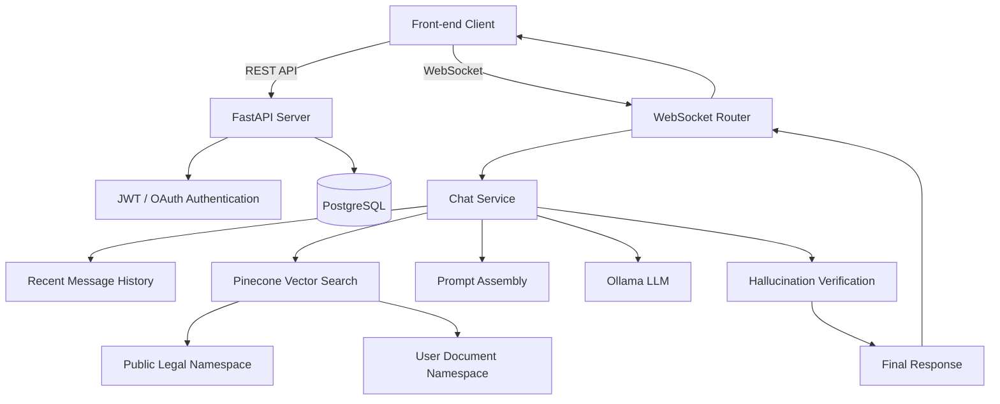
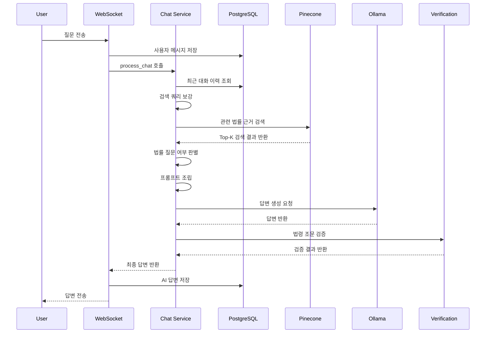
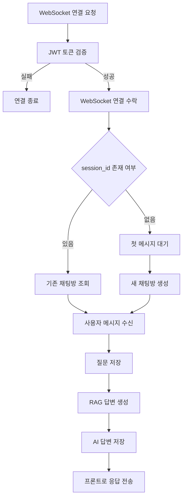
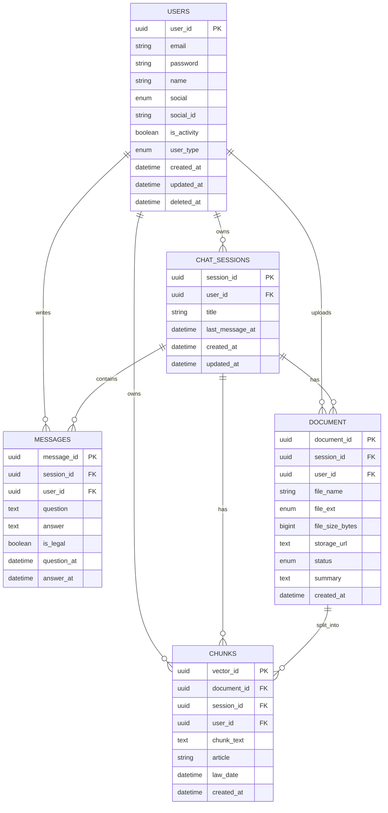
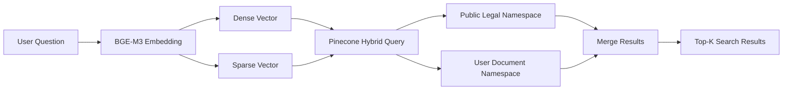

# ⚖️ Legal Chat Bot Back-end

법률 상담 챗봇 서비스를 위한 **FastAPI 기반 백엔드 서버**입니다.

사용자의 법률 질문을 WebSocket으로 수신하고, PostgreSQL에 대화 이력을 저장하며,
Pinecone Vector DB와 Ollama LLM을 활용해 RAG 기반 답변을 생성합니다.

---

## Tech Stack

| Category            | Stack                                                                                                                                                                                                                                                                                      |
| ------------------- | ------------------------------------------------------------------------------------------------------------------------------------------------------------------------------------------------------------------------------------------------------------------------------------------ |
| Language            |                                                                                                                                                                                  |
| Backend             |    |
| Database            |                                                      |
| Authentication      |                                                         |
| Realtime            |                                                                                                                                                                                                 |
| LLM / RAG           |                                                  |
| Embedding           |                                                                                                       |
| Document Processing |                                                                                                                 |
| Infra               |                                                        |

---

## 프로젝트 개요

Legal Chat Bot Back-end는 사용자의 법률 질문을 실시간으로 처리하고,
법률 데이터와 사용자 문서를 기반으로 답변을 생성하는 RAG 기반 백엔드 서버입니다.

사용자는 WebSocket을 통해 질문을 전송하고, 서버는 질문과 이전 대화 맥락을 활용해 검색 쿼리를 보강합니다.
이후 Pinecone Vector DB에서 관련 법률 근거를 검색하고, Ollama 기반 LLM에 검색 결과를 포함한 프롬프트를 전달하여 최종 답변을 생성합니다.

또한 LLM 답변에 포함된 법령 조문이 실제 검색 근거에 존재하는지 검증하여,
법률 챗봇에서 발생할 수 있는 환각 가능성을 줄이는 구조를 목표로 합니다.


---

## 주요 기능

### 인증 및 사용자 관리

* 이메일 기반 회원가입 및 로그인
* JWT Access Token / Refresh Token 발급
* Refresh Token 기반 Access Token 재발급
* 로그아웃 시 토큰 블랙리스트 처리
* 사용자별 활성 세션 관리
* 카카오 OAuth 로그인 연동

### 실시간 채팅

* WebSocket 기반 실시간 질문/답변 처리
* JWT 토큰을 이용한 WebSocket 사용자 인증
* `session_id` 기반 기존 채팅방 입장
* `session_id`가 없는 경우 첫 메시지를 기준으로 새 채팅방 생성
* 사용자 질문과 AI 답변을 PostgreSQL에 저장

### 법률 RAG 답변 생성

* 최근 대화 이력을 활용한 검색 쿼리 보강
* Pinecone Vector DB 기반 Top-K 검색
* 공용 법률 데이터와 사용자 문서 데이터 검색 분리
* 법률 관련 질문 여부 판별
* 검색 결과 기반 LLM 프롬프트 구성
* Ollama LLM 호출을 통한 답변 생성
* 법령 조문 기반 환각 검증

### 문서 관리

* 채팅방 단위 문서 업로드
* PDF, HWP/HWPX, DOCX, PPT/PPTX, XLSX, TXT 파일 처리 구조
* 업로드 문서의 파일명, 크기, 저장 경로, 상태값 관리
* 문서와 채팅방, 사용자, 청크 데이터 간 관계 관리

---

## 기술 스택

### Backend

* Python 3.11
* FastAPI
* Uvicorn
* SQLAlchemy
* Pydantic
* PostgreSQL
* JWT
* WebSocket
* Kakao OAuth

### AI / RAG

* Ollama
* law-qwen-7b
* BAAI/bge-m3
* FlagEmbedding
* Pinecone
* PyMuPDF
* PaddleOCR
* Transformers
* PyTorch

### Infra

* Docker
* GitHub
* `.env` 기반 설정 관리

---

## 시스템 구조



---

## RAG 처리 흐름



RAG 파이프라인은 다음 순서로 동작합니다.

1. 사용자의 질문을 WebSocket으로 수신합니다.
2. 현재 채팅방의 최근 대화 이력을 조회합니다.
3. 직전 질문과 현재 질문을 조합하여 검색 쿼리를 보강합니다.
4. Pinecone에서 질문과 관련된 법률 근거를 검색합니다.
5. 검색 결과의 score를 기준으로 법률 질문 여부를 판단합니다.
6. 검색 결과와 대화 이력을 기반으로 LLM 프롬프트를 구성합니다.
7. Ollama LLM을 호출하여 답변을 생성합니다.
8. 답변에 포함된 법령 조문이 검색 근거에 존재하는지 검증합니다.
9. 최종 답변과 검증 결과를 반환합니다.

---

## WebSocket 채팅 흐름

WebSocket 엔드포인트는 다음 형식으로 연결합니다.

```text
/ws/chat?token={access_token}&session_id={session_id}
```

`session_id`는 선택값입니다.
기존 채팅방에서 대화할 경우 `session_id`를 전달하고, 새로운 대화를 시작할 경우 생략합니다.



응답 예시는 다음과 같습니다.

```json
{
  "type": "message",
  "session_id": "session uuid",
  "message_id": "message uuid",
  "question": "전세보증금을 돌려받지 못하면 어떻게 해야 하나요?",
  "answer": "전세보증금 반환 문제는...",
  "question_at": "2026-06-26T10:00:00+00:00",
  "answer_at": "2026-06-26T10:00:03+00:00"
}
```

---

## 데이터베이스 구조



---

## 주요 도메인 모델

### User

사용자 계정 정보를 관리합니다.

* 일반 회원가입 사용자
* 카카오 OAuth 사용자
* 구글 OAuth 확장 가능 구조
* 관리자 / 일반 사용자 권한 구분
* 활성 여부 및 삭제 시각 관리

### Chat Session

사용자의 채팅방 단위를 관리합니다.

* 사용자별 여러 채팅방 생성
* 채팅방 제목 저장
* 마지막 메시지 시각 관리
* 메시지, 문서, 청크와 연결

### Message

채팅방 안의 질문과 답변을 관리합니다.

* 사용자 질문 저장
* AI 답변 저장
* 법률 질문 여부 저장
* 질문 시각과 답변 시각 저장

### Document

사용자가 채팅방에 업로드한 문서 정보를 관리합니다.

* 원본 파일명
* 파일 확장자
* 파일 크기
* 저장 경로
* 문서 처리 상태
* 요약 정보

### Chunk

문서 또는 법률 데이터에서 분리된 청크 정보를 관리합니다.

* Pinecone vector id와 매핑
* 문서, 채팅방, 사용자와 연결
* 청크 본문 저장
* 법령 조문 메타데이터 저장
* 법령 시행일 또는 개정일 저장

---

## Vector Search 구조

Pinecone 검색은 질문의 목적에 따라 세 가지 모드로 구분됩니다.

### general

공용 법률 데이터 namespace에서 검색합니다.
일반적인 법률 질문에 사용됩니다.

### document

사용자 개인 문서 namespace에서 검색합니다.
업로드한 문서를 기반으로 질문할 때 사용됩니다.

### hybrid

사용자 문서와 공용 법률 데이터를 함께 검색합니다.
업로드 문서가 존재하는 채팅방에서 문서 내용과 법률 근거를 함께 활용할 때 사용됩니다.



---

## 프로젝트 구조

```text
Back-end/
├── app/
│   ├── core/
│   │   ├── config.py
│   │   ├── security.py
│   │   └── token_store.py
│   │
│   ├── crud/
│   │   └── message_crud.py
│   │
│   ├── db/
│   │   ├── db.py
│   │   ├── models/
│   │   │   ├── user.py
│   │   │   ├── chat.py
│   │   │   ├── document.py
│   │   │   └── chunk.py
│   │   │
│   │   └── vector/
│   │       ├── client.py
│   │       └── embedding.py
│   │
│   ├── routes/
│   │   ├── auth/
│   │   │   ├── login.py
│   │   │   └── signup.py
│   │   │
│   │   ├── chat/
│   │   │   ├── session.py
│   │   │   └── document.py
│   │   │
│   │   ├── oauth/
│   │   │   └── kakao.py
│   │   │
│   │   ├── user/
│   │   │   └── user.py
│   │   │
│   │   └── websocket/
│   │       └── chat.py
│   │
│   ├── schemas/
│   ├── services/
│   │   ├── chat_service.py
│   │   ├── vector_service.py
│   │   ├── prompt_service.py
│   │   ├── service.py
│   │   ├── hallucination_service.py
│   │   └── kakao_service.py
│   │
│   ├── app.py
│   └── main.py
│
├── dataset/
├── Dockerfile
├── requirements.txt
├── run.bat
└── README.md
```

---

## 실행 방법

### 1. Repository Clone

```bash
git clone https://github.com/Legal-Chat-Bot/Back-end.git
cd Back-end
```

### 2. 가상환경 생성

Windows PowerShell 기준입니다.

```powershell
python -m venv venv
.\venv\Scripts\activate
```

### 3. 패키지 설치

```bash
pip install -r requirements.txt
```

### 4. 서버 실행

```bash
uvicorn app.app:app --reload --host 0.0.0.0 --port 8000
```

서버가 정상 실행되면 다음 주소에서 확인할 수 있습니다.

```text
http://localhost:8000
```

Swagger 문서는 다음 주소에서 확인할 수 있습니다.

```text
http://localhost:8000/docs
```

---

## Docker 실행

```bash
docker build -t legal-chat-backend .
```

```bash
docker run -p 8000:8000 legal-chat-backend
```

---

## 구현 포인트

### JWT 인증 구조

Access Token과 Refresh Token을 분리하여 인증을 처리합니다.
로그아웃된 토큰은 블랙리스트에 등록하여 재사용을 방지합니다.

### 카카오 OAuth 연동

프론트엔드에서 전달한 카카오 인가 코드를 백엔드에서 처리합니다.
백엔드는 카카오 사용자 정보를 조회한 뒤, 서비스 자체 JWT를 발급합니다.

### WebSocket 실시간 채팅

WebSocket 연결 시 JWT를 검증합니다.
검증된 사용자만 채팅방에 입장할 수 있으며, 질문과 답변은 PostgreSQL에 저장됩니다.

### RAG 답변 생성

사용자 질문과 최근 대화 이력을 활용해 검색 쿼리를 보강합니다.
Pinecone에서 관련 법률 근거를 검색한 뒤, Ollama LLM을 호출하여 답변을 생성합니다.

### Hybrid Vector Search

공용 법률 데이터와 사용자 문서 데이터를 namespace 단위로 분리합니다.
문서가 준비된 채팅방에서는 사용자 문서와 공용 법률 데이터를 함께 검색할 수 있습니다.

### 환각 검증

LLM 답변에 포함된 법령 조문을 추출하고, 검색 결과에 해당 조문이 존재하는지 확인합니다.
검색 근거에 없는 조문은 경고 정보로 분리하여 반환할 수 있도록 구성되어 있습니다.

---

## 담당 역할

* FastAPI 기반 백엔드 서버 구조 설계
* JWT 인증 및 토큰 재발급 로직 구현
* 카카오 OAuth 로그인 연동
* WebSocket 기반 실시간 채팅 기능 구현
* PostgreSQL 기반 주요 도메인 모델 설계
* 채팅 세션 및 메시지 저장 구조 구현
* 문서 업로드 및 문서 상태 관리 구조 구현
* Pinecone Vector DB 연동
* BGE-M3 기반 Hybrid Embedding 구조 적용
* Ollama LLM 연동
* RAG 답변 생성 파이프라인 구현
* 법령 조문 기반 환각 검증 로직 구현

---

## 프로젝트 핵심 요약

Legal Chat Bot Back-end는 단순한 챗봇 API 서버가 아니라,
사용자의 질문과 대화 맥락, 법률 검색 결과, 사용자 문서를 함께 활용하는 RAG 기반 법률 상담 백엔드입니다.

실시간 WebSocket 채팅, PostgreSQL 데이터 관리, Pinecone Hybrid Search, Ollama LLM 연동을 통해
법률 질문에 대한 근거 기반 답변 생성을 목표로 합니다.
